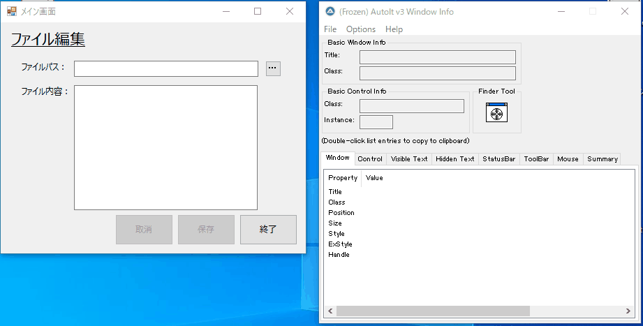

# WindowsアプリケーションのRPA化（AutoIt）
## RPAの種類
RPAには多くの実現手段があるが、DOM解析、xPath指定などで行うWebアプリケーションと異なり、（特にレガシーな構造の）Windowsアプリケーションを自動制御する機能は限られている。著名なアプリケーションとしては主に以下のようなものがある。  
- UWSC
- AutoIt
- UI Automation  

これら３つの正しい機能比較については、次のようなサイトが参考になると思うので参照されることをお勧めする。  
  - [Qiita 自動化ツールの比較(AutoIt vs UWSC)](https://qiita.com/yutaka-tanaka/items/79287a6a401b20d77208)  
  - [RPA UIAutomationでアプリケーションを自動化する](https://www.ninjastars-net.com/entry/2019/01/21/200000)

いずれもアプリケーションを自動実行し、その結果を評価（画面内のテキストを取得する）といった機能を有している。いくつか動かしてみた経験上、個人的にみる三者の特徴と評価は次のとおりだ。  

  |評価|製品名|開発元|最新性（URL）|情報量|
  |---|---|---|---|---|
  |1|AutoIt|海外フリーウェア|◎ [2018/3/16](https://www.autoitscript.com/site/autoit/downloads/)|〇|
  |2|UWSC|国産フリーウェア|△ 2017/4/18 以降、公式サイト没|◎|
  |3|UI Automation|Microsoft(開発者向けツール)|〇 [2016/12/31](https://archive.codeplex.com/?p=uiautomation)|△|

特に`UWSC`は1999年からリリースが続いていたことでファンが多かったようであるが、2017/04以降、公式サイトにアクセスできなくなっており、この代替えとして`AutoIt`を推すサイトも多い。
一方で`UI Automaiton`は Microsoft公式にもかかわらず、リファレンスに相当する情報が非常にわかりづらい。

今回は、このうちの`AutoIt`に関して使用方法や特徴などを解説する。  
<div align="center"><p></div>

## AutoIt 特徴
以下、wikipediaからの転記である（主な特徴）。
- 実行環境はWindows
- BASICに似た言語構造を持つ
- TCPとUDPをサポート
- COMオブジェクトをサポート
- DLLをサポート
- コンソールアプリケーションの実行と標準ストリームへのアクセスが可能
- GUI、メッセージボックス、入力ボックスの作成が可能
- 音声ファイルの制御可能
- マウス操作のシミュレートが可能
- ウィンドウ、プロセスの操作が可能
- アプリケーション、アプリケーション内の各コントロールへの入力、キーストロークの送信が可能
- スクリプトをスタンドアローンの実行形式にコンパイル可能
- Unicodeをサポート(v3.2.4.0以降)
- 64ビットコードをサポート(v3.2.10.0以降)
- 正規表現をサポート
- Windows Vistaのユーザーアカウント制御に対応  

特に`スクリプトをスタンドアローンの実行形式にコンパイル可能`は、実行内容を exeとしてパッケージ化することができ、実行時にAutoItのランタイムを必要としない。また、パッケージに包含されている`AutoItX.dll`を`regsvr32`コマンドでレジストリ登録すれば、多くのプログラムからAutoItメソッドをコールすることが可能であるため、容易に組み込むことができ（Ruby、Python、Javaなどの事例紹介があったが、Visual Basic 6.0でも可能であった）、実行環境を自由に選ぶことができる。  
また、ドキュメントのヘルプが有志で日本語化されていることもありがたく、内容も丁寧に書かれているので使用方法につまることは少ない。  
- [AutoIt v3 ドキュメント 日本語訳プロジェクト](http://blog.livedoor.jp/blackcode/archives/1224220.html)

---
## AutoIt 実践
### AutoIt インストール
以下の公式URLにアクセスし、右上のメニューバーから「DOWNLOAD」を選択して、ダウンロードページに進み「`AutoIt Full Installation…`」からインストーラをダウンロードする。

https://www.autoitscript.com/site/autoit-script-editor/downloads/


### AutoIt Window Info
AutoItでは操作したい画面の項目は、Class名、Instance値などで指定する。  
各画面の項目名が、どのようなクラス名をもっているのかについては、インストールされたスタートメニューの中にある「`AutoIt Window Info`」によって確認ができる。下の動画のとおり、ツールを起動した後、操作したい項目に照準アイコンをドラッグドロップすることで、ツール上にClass名、Instance値が表示される。

<div align="center"><p></div>

### AutoIt スクリプトの作成
AutoItスクリプトはテキストエディタ等で作成することができ、拡張子名を「*.au3」とすれば、AutoItで起動することができる。以下に、Git上に掲載したアプリケーションを、遠隔操作するスクリプトと、デモ動画を掲載するので見比べてみてほしい。

#### アプリケーションの仕様
- 「ファイルパス」にパスを入れると「ファイル内容」に内容が表示される。

#### AutoIt サンプルスクリプト
```
;## 初期設定 ##
;ウィンドウタイトル照合モード : 部分一致
AutoItSetOption("WinTitleMatchMode",2)
;アプリ起動
run(".\WinApp.exe")
;アプリが起動するまでウエイト
WinWait("メイン画面","")

;## 操作開始 ##
;「ファイルパス」入力
ControlSetText("メイン画面","","[CLASS:WindowsForms10.EDIT.app.0.141b42a_r9_ad1;INSTANCE:2]","notExistFile.txt")

;(デモ用ウエイト)
Sleep(1000)

;「ファイルパス」参照ボタンクリック
ControlClick("メイン画面","","[CLASS:WindowsForms10.BUTTON.app.0.141b42a_r9_ad1;INSTANCE:2]")

;ウィンドウが表示されるまでウエイト
WinWait("編集するファイルを選択してください。","")

;(デモ用ウエイト)
Sleep(2000)

;「キャンセル」クリック
ControlClick("[CLASS:#32770]","","[CLASS:Button;INSTANCE:2]")

;(デモ用ウエイト)
Sleep(1000)

;「ファイルパス」再入力
ControlSetText("メイン画面","","[CLASS:WindowsForms10.EDIT.app.0.141b42a_r9_ad1;INSTANCE:2]","sample_memo.txt")

;「ファイルパス」フォーカス設定
ControlFocus("メイン画面","","[CLASS:WindowsForms10.EDIT.app.0.141b42a_r9_ad1;INSTANCE:2]")

;(デモ用ウエイト)
Sleep(1000)

;「ファイルパス」TABキー入力 → 内容表示
ControlSend("メイン画面","","[CLASS:WindowsForms10.EDIT.app.0.141b42a_r9_ad1;INSTANCE:2]","{TAB}")

;(デモ用ウエイト)
Sleep(1000)

;「ファイルパス」フォーカス設定
ControlFocus("メイン画面","","[CLASS:WindowsForms10.EDIT.app.0.141b42a_r9_ad1;INSTANCE:1]")

;「↓」押下
ControlSend("メイン画面","","[CLASS:WindowsForms10.EDIT.app.0.141b42a_r9_ad1;INSTANCE:1]","{DOWN}")

;「ファイル内容」追記
ControlSetText("メイン画面","","[CLASS:WindowsForms10.EDIT.app.0.141b42a_r9_ad1;INSTANCE:1]","追加文章記入…やっぱやめます。取消ぽちっとしてから終了します。")

;(デモ用ウエイト)
Sleep(2000)

;「取消」クリック
ControlClick("メイン画面","","[CLASS:WindowsForms10.BUTTON.app.0.141b42a_r9_ad1;INSTANCE:1]")

;(デモ用ウエイト)
Sleep(1000)

;「終了」クリック
ControlClick("メイン画面","","[CLASS:WindowsForms10.BUTTON.app.0.141b42a_r9_ad1;INSTANCE:4]")

;終了メッセージ
MsgBox(1,"AutoIt","以上でデモ終了です！")
```

#### AutoIt サンプルスクリプト による動作
<div align="center"><p></div>

このように、BASIC言語のような簡単なコマンドで外部アプリケーションを自動操作することができる。

---

## その他苦労したこと
それほど多くはないが、以下の点、ハマったので注意していただきたい。
- 操作するウィンドウをタイトルで補足する場合、タイトルが日本語であると、スクリプトファイル自体がShift-JISで書かれていないと操作ができないこと。
- どこまで実行されたかはわからないため、インラインメッセージなどでこまめにデバッグする必要あり。特に「WinWait」など、「～Wait」系のコマンドを実行すると、画面が表示されるまで永遠に待ち続けてしまう。→タスクマネージャからKILL!
- 実行権限が異なるウインドウが補足できない。アプリケーションを管理者権限で起動しつつ、AutoItをユーザ権限で起動すると、画面が補足できない。
